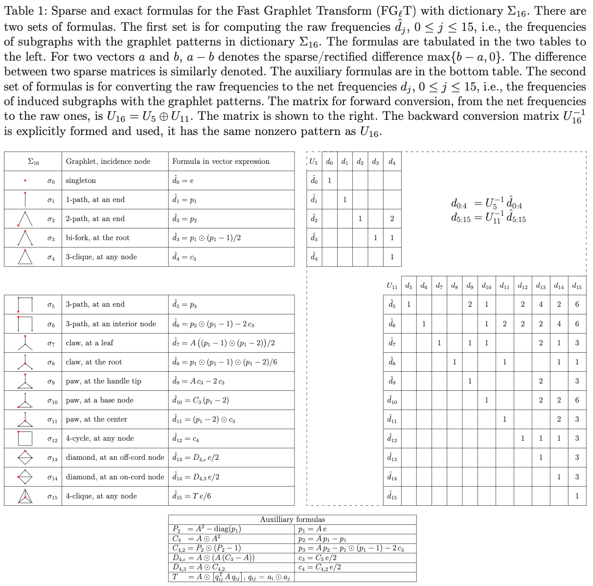

# FGlT   Fast Graphlet Transform

-   [Summary](#summary)
-   [Getting started](#getting-started)
    -   [System environment](#system-environment)
    -   [Prerequisites](#prerequisites)
    -   [Installation](#installation)
    -   [Testing](#testing)
    -   [Usage demo](#usage-demo)
    -   [Python](#python)
    -   [Julia](#julia)
    -   [MATLAB](#matlab)
-   [License and community guidelines](#license-and-community-guidelines)
-   [Contributors](#contributors)

# Summary

We provide `FGlT`, a `C/C++` multi-threading library, for Fast
Graphlet Transform of large, sparse, undirected networks/graphs. The
graphlets in dictionary Σ16, shown in
Figure 1, are used as encoding elements to capture
topological connectivity quantitatively and transform a graph
G=(V,E) into a |V| x 16 array of graphlet frequencies at all
vertices. The 16-element vector at each vertex represents the
frequencies of induced subgraphs, incident at the vertex, of the
graphlet patterns. The transformed data array serves multiple types of
network analysis: statistical or/and topological measures, comparison,
classification, modeling, feature embedding and dynamic variation,
among others. The library `FGlT` is distinguished in
the following key aspects.
(1) It is based on the [fast, sparse and exact transform formulas](https://arxiv.org/abs/2007.11111)
which are of the lowest time and space complexities
among known algorithms, and, at the same time, in ready form for
globally streamlined computation in matrix-vector operations.
(2) It leverages prevalent multi-core processors, with multi-threaded
programming in [`Cilk`](http://cilk.mit.edu), and uses sparse graph computation
techniques to deliver high-performance network analysis to individual
laptops or desktop computers.
(3) It has `Python`, `Julia`, and `MATLAB` interfaces for easy integration
with, and extension of, existing network analysis software.

# Getting started 

## System environment 

The FGlT library has been tested under Ubuntu 18.04 and macOS Catalina
v10.15.6. The prerequisites is a `C++` compiler and the
[Meson](https://mesonbuild.com) package with
[Ninja](https://ninja-build.org) support. If the specified compiler
supports `cilk`, the compiled program will run in parallel.

## Prerequisites

You can install `meson` and `ninja` issuing

    pip install meson
    pip install ninja

## Installation 

After installing `meson` and `ninja`, you can install FGlT:

    meson build
    cd build
    ninja

To specify the `C++` compiler:

    env CXX=g++-7 meson build
    
for example, to use the [OpenCilk](http://cilk.mit.edu) compiler,
installed under `/usr/pkg/opencilk`, you can install FGlT using the command

    env CXX=/usr/pkg/opencilk/bin/clang++ meson build

If you wish to install system-wide the header files, libraries, and
the `fglt` executable, issue:

    ninja install
    
*Note*: Depending on your setup, you might need `sudo` privileges for
this operation.

To generate the documentation (assuming `Doxygen` is installed on your
machine):

    cd docs
    make
    open html/index.html

## Testing

To test whether installation was successful, issue

    ninja test
    
under `build` directory.

## Usage demo

The FGlT executable is named `fglt`. Usage:
    
    fglt <filename>
    
where `<filename>` is the path to a sparse matrix stored in symmetric,
coordinate, MatrixMarket format. The graphlet frequencies are exported
in the file `freq_net.csv`, within the working directory. For example,

    fglt ../testdata/s12.mtx
    less freq_net.csv

## Python

In order to run the `fglt()` C++ function we will need the [ctypes](https://docs.python.org/3/library/ctypes.html) and scipy libraries:

    pip install ctypes
    pip install scipy

A `Python` demo script is provided under `python`, which can be invoked by:

    python demo.py
    
and showcases the use of FGlT on a couple of test graphs.

## Julia

You can use FGlT with Julia with the
[FGLT.jl](https://github.com/NorthSailor/FGLT.jl) package. Further
instructions and demo scripts are available within.

## MATLAB

To build the `MATLAB` interface to FGlT, issue

    fgltmake
    
in `MATLAB` command window, under `MATLAB` directory.

A `MATLAB` demo script is provided under `MATLAB`:

    demo.m
    
which showcases the use of FGlT on a couple of test graphs.

# License and community guidelines 

The FGlT library is licensed under the [GNU general public
license v3.0](https://github.com/fcdimitr/fglt/blob/master/LICENSE).
To contribute to FGlT or report any problem, follow our
[contribution
guidelines](https://github.com/fcdimitr/fglt/blob/master/CONTRIBUTING.md)
and [code of
conduct](https://github.com/fcdimitr/fglt/blob/master/CODE_OF_CONDUCT.md).

# Contributors 

*Design and development*:\
Dimitris Floros1, Nikos Pitsianis1,2, 
Xiaobai Sun2

*Development of Julia and Python wrappers*:\
Jason Barmparesos1, Konstantinos Kitsios1

1 Department of Electrical and Computer Engineering,
Aristotle University of Thessaloniki, Thessaloniki 54124, Greece\
2 Department of Computer Science, Duke University, Durham, NC
27708, USA
